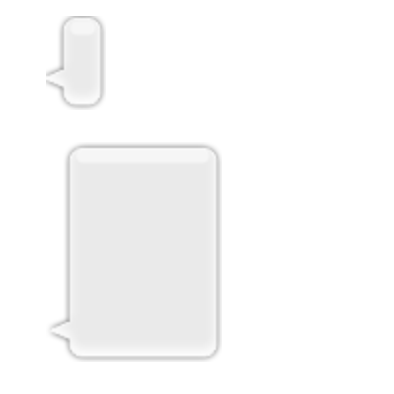

## UIImage

> An object that manages image data in your app.	
>
> 앱의 이미지 데이터를 관리하는 객체


이미지 오브젝트들은 다음과 같은 것들에 사용될 수 있다. 

- 이미지를 [`UIImageView`](https://developer.apple.com/documentation/uikit/uiimageview) 객체에 할당해 이미지를 보여준다.
- 버튼, 슬라이더, 세그먼트 컨트롤과 같은 시스템 컨트롤들을 커스텀하는데 이미지를 사용한다.
- 뷰나 다른 그래픽 컨텍스트에 이미지를 직접 그린다.
- 이미지 데이터를 필요로 하는 API에 이미지를 전달한다.


### Creating Image Objects

아래의 방법들을 사용해 이미지 객체를 생성하기 위해서는 파일이나 데이터 구조에 이미지가 있어야 한다. 

1.  [`init(named:in:compatibleWith:)`](https://developer.apple.com/documentation/uikit/uiimage/1624154-init) 메서드 (또는 `init(named:)` 메서드) 

   이미지 에셋이나 앱의 메인 번들에서 이미지를 생성한다.

   이 메서드는 이미지 데이터를 자동으로 캐싱하기 때문에 자주 사용되는 이미지에 권장된다.

   캐싱되어 있는 이미지 오브젝트가 없다면 에셋 카탈로그나 디스크에서 이미지를 생성한다. 

2.  [`imageWithContentsOfFile:`](https://developer.apple.com/documentation/uikit/uiimage/1624123-imagewithcontentsoffile) , [`init(contentsOfFile:)`](https://developer.apple.com/documentation/uikit/uiimage/1624112-init)

   초기 데이터가 번들에 있지 않은 경우에 이미지를 생성한다. 

   이 메서드는 이미지 데이터를 매번 디스크에서 로드하기 때문에 같은 이미지를 반복적으로 로드할때는 사용하지 않는 것이 좋다. 

3. [`animatedImage(with:duration:)`](https://developer.apple.com/documentation/uikit/uiimage/1624149-animatedimage) , [`animatedImageNamed(_:duration:)`](https://developer.apple.com/documentation/uikit/uiimage/1624094-animatedimagenamed) 

   여러개의 연속적인 이미지들을 압축한 하나의 `UIImage` 객체를 생성한다.

   결과 이미지를  [`UIImageView`](https://developer.apple.com/documentation/uikit/uiimageview) 객체에 넣어 애니메이션을 만든다.


### Defining a Stretchable Image

[`resizableImage(withCapInsets:)`](https://developer.apple.com/documentation/uikit/uiimage/1624102-resizableimage) 또는 [`resizableImage(withCapInsets:resizingMode:)`](https://developer.apple.com/documentation/uikit/uiimage/1624127-resizableimage)메서드를 사용해서 stretchable 이미지를 정의할 수 있다. 이 인셋들은이미지를 두 개 이상의 부분으로 세분화한다. 각 인셋 영역에 0이 아닌 값을 넣어서 아래 그림과 같이 이미지를 9개로 나눌 수 있다. 


각각의 인셋은 주어진 치수로 늘어나지 않는 영역을 정의한다. 이미지의 상단 및 하단 인셋은 고정된 높이를 유지하고 왼쪽과 오른쪽의 인셋은 고정된 넓이를 유지한다. 아래 그림에서는 사용 가능한 공간을 채우기 위해 이미지 자체가 늘어나면서 9개로 나눠진 이미지의 각 부분이 늘어나는 것을 보여준다. 이미지의 모서리는 가로와 세로 인셋 사이에 있기 때문에 크기가 변하지 않는다. 




```swift
let insets = UIEdgeInsets(top: 12.0, left: 20.0, bottom: 22.0, right: 12.0)
let image = UIImage(named: "messageBubble")
image?.resizableImage(withCapInsets: insets, resizingMode: .stretch)
```

&nbsp;


## UIImageView

>  이미지 뷰는 말 그대로 **이미지를 보여주는 뷰**이다. 이 이미지는 한 장의 이미지일 수도 있고 애니메이션 이미지 시퀀스일 수도 있다. 

```swift
class UIImageView: UIView
```

`UIImageView`는 `UIView` 를 상속 받는다.


`UIImage` 객체를 사용해서 이미지를 그린다.

### Understanding How Images Are Scaled

이미지 뷰는  [`contentMode`](https://developer.apple.com/documentation/uikit/uiview/1622619-contentmode) 프로퍼티를 사용해서 이미지를 어떻게 표시할지 설정한다.

이미지뷰는 공간의 전부 또는 일부에 맞게 이미지의 크기를 조절한다. 이미지뷰 자체의 크기가 변하면 필요에 따라 자동으로 이미지의 크기를 조절한다.

cap insets [`UIView.ContentMode.scaleAspectFit`](https://developer.apple.com/documentation/uikit/uiview/contentmode/scaleaspectfit) 과 [`UIView.ContentMode.scaleAspectFill`](https://developer.apple.com/documentation/uikit/uiview/contentmode/scaleaspectfill)  모드는 이미지의 가로세로비율을 유지하면서 이미지를 공간에 맞게 fit하거나 fill 한다. 

[`UIView.ContentMode.scaleToFill`](https://developer.apple.com/documentation/uikit/uiview/contentmode/scaletofill) 모드는 이미지의 가로세로비율을 무시하고 이미지를 조절해 이미지가 왜곡될 수도 있다. 

For an image without cap insets, the presentation of the image is determined solely by the image view’s `contentMode` property. The [`UIView.ContentMode.scaleAspectFit`](https://developer.apple.com/documentation/uikit/uiview/contentmode/scaleaspectfit) and [`UIView.ContentMode.scaleAspectFill`](https://developer.apple.com/documentation/uikit/uiview/contentmode/scaleaspectfill) modes scale the image to fit or fill the space while maintaining the image’s original aspect ratio. TheUIView.ContentMode.scaleToFill`](https://developer.apple.com/documentation/uikit/uiview/contentmode/scaletofill) value scales the image without regard to the original aspect ratio, which can cause the image to appear distorted. Other content modes place the image at the appropriate location in the image view’s bounds without scaling it.

For a resizable image with cap insets, those insets affect the final appearance of the image. Specifically, cap insets define which parts of the image may be scaled and in which directions. You can create a resizable image that stretches using the [`resizableImage(withCapInsets:resizingMode:)`](https://developer.apple.com/documentation/uikit/uiimage/1624127-resizableimage) method of `UIImage`. When using an image of this type, you typically set the image view’s content mode to [`UIView.ContentMode.scaleToFill`](https://developer.apple.com/documentation/uikit/uiview/contentmode/scaletofill) so that the image stretches in the appropriate places and fills the image view’s bounds. 

For tips on how to prepare images, see [Debugging Issues with Your Image View](https://developer.apple.com/documentation/uikit/uiimageview#1658399). For more information on creating resizable images with cap insets, see [`UIImage`](https://developer.apple.com/documentation/uikit/uiimage).


---

### Reference

https://developer.apple.com/documentation/uikit/uiimage

https://riptutorial.com/ios/example/8603/resizable-image-with-caps

