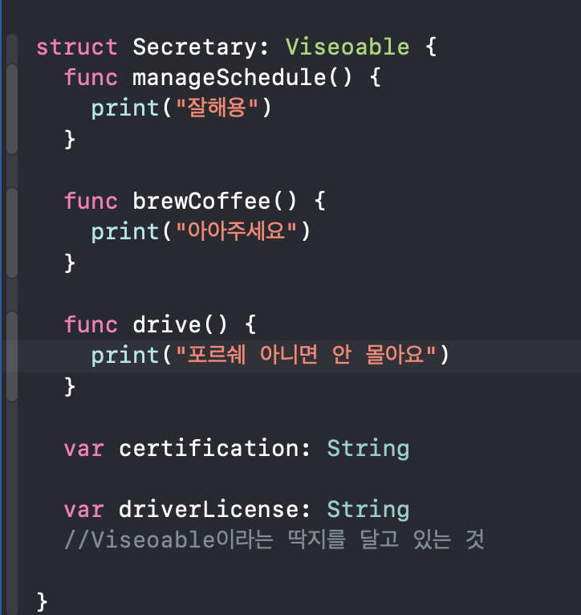
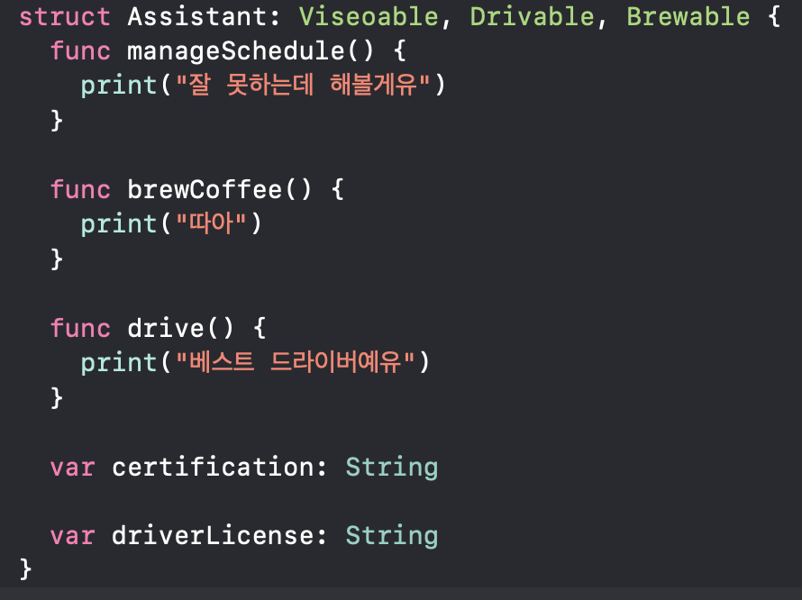
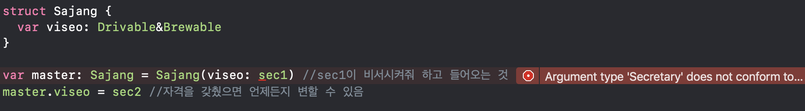

# Protocol

- 프로토콜은 일종의 **'명찰'**이다.

  

  야곰 사장님의 비서 채용 공고

- 이런 자격을 가진 사람이 비서였으면 좋겠어! 
  → 명찰 달고 오면 비서가 될 자격이 생기는 것
- 딱지 달고 오지 않으면 자격이 있는지 알 수 없음 → 비서가 될 수 없음

채용 공고 - 채용 공고 자격에 맞는 친구들만 채용될 수 있다.

```swift
//비서가 될 사람은 이런 조건을 가져야 해!
protocol Viseoable { //~를 할 수 있다 등의 이름으로 지음
  //비서가 될 수 있는 조건?
  func manageSchedule() //{}를 이용해서 구현을 하지 않고 비서는 이런걸 할 줄 아는 사람이여야 한다(스케줄을 관리할 수 있는 사람)는 것만 말함
  func brewCoffee()
  func drive()
  
  var certification: String { get } //학위를 주진 않고 학위를 받을 수 있으면 됨
  var driverLicense: String { get }
}

struct Secretary: Viseoable {
  func manageSchedule() {
    print("잘해용")
  }

  func brewCoffee() {
    print("아아주세요")
  }
  
  func drive() {
    print("포르쉐 아니면 안 몰아요")
  }
  
  var certification: String
  
  var driverLicense: String
  //Viseoable이라는 딱지를 달고 있는 것
  
}

let sec1: Secretary = Secretary(certification: "한국대학교 졸업장",
                                driverLicense: "2종 자동")

struct Assistant: Viseoable {
  func manageSchedule() {
    print("잘 못하는데 해볼게유")
  }
  
  func brewCoffee() {
    print("따아")
  }
  
  func drive() {
    print("베스트 드라이버예유")
  }
  
  var certification: String
  
  var driverLicense: String
}
let sec2: Assistant = Assistant(certification: "한국대학교 석사",
                                driverLicense: "1종 보통")
struct Sajang {
  var viseo: Viseoable //protocol에 부합하는 자는 모두 이 곳에 들어올 수 있다.(비서의 자격을 갖췄으면 전부 들어올 수 있음)
}

var master: Sajang = Sajang(viseo: sec1) //sec1이 비서시켜줘 하고 들어오는 것
master.viseo = sec2 //자격을 갖췄으면 언제든지 변할 수 있음
```


Viseoable 프로토콜에서 필수적으로 요구하는 조건들이 없음  [//Viseoable](//viseoable) 프로토콜을 준수하지 않는다.







Drivable과 Brewable이 필요한데, sec1은 Viseoable 프로토콜을 채택하고 있음

`struct Secretary: Viseoable {`

`struct Assistant: Viseoable, Drivable, Brewable {`

 프로토콜일 경우 `Drivable&Brewable` 과 같이 & 를 사용해서 여러 개의 프로토콜의 채택할 수 있다. 

- 한 가지 타입 또는 프로토콜과 프로토콜의 조합으로 가능

**어떤 역할들에 대한 정의를 할 때 사용할 수 있다.** 실체는 없지만 이 타입의 인스턴스는 이런 역할을 해낼 수 있다는 것을 명확한 표시를 하는 약속이다.

`var viseo = Viseoable`이 아니고 `var viseo = Assistant` 처럼 타입을 넣어버리면 해당 타입(`Assistant`)만 들어올 수 있다. 그렇게 되면 확장성이 떨어지는 등의 문제가 발생한다.

대학교는 한국대학교 학사, 따뜻한 아메리카노만 타고 등등.. **이런 특징을 가진 사람만을 원해요** 로 되는 것 

위와 같이 딱 맞는 사람을 구하기가 어렵기 때문에 타입을 넣지 않고 프로토콜을 사용해서 선언된 자격조건을 갖춘 사람이기만 하면 된다는 것 (특징 X, 자격 O)

ex. 차가 사고가 나면 렌트카 회사에서 차를 아무거나 줌 (굴러갈 수만 있으면 된다는 조건이 있기 때문에) 

> 타입은 상관 없고 목적에만 부합하면 되는 경우에 프로토콜을 사용하면 된다.
> 프로토콜을 사용하는 가장 큰 이유는 유연성!

`struct Secretary: Viseoable {`는 Secretary struct가 Viseoable을 상속한다고 말하지 않고 **채택한다**라고 한다.

아래에 구현하는 부분은 프로토콜을 **준수한다** 라고 한다. 


여러 타입의 인스턴스가 들어왔으면 좋겠는데? 해서 Any 타입을 쓰는 경우가 있다. Any 타입을 사용하면 받아와서 어떤 타입인지 확인을 해줘야 되고 여러가지 불편한 점이 있다. 그럴 때 프로토콜을 사용하면 좋다.