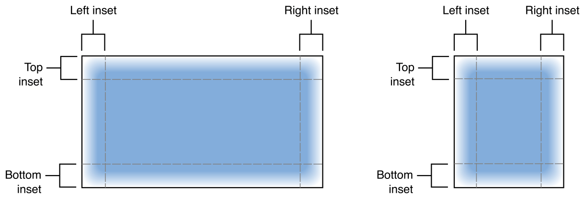
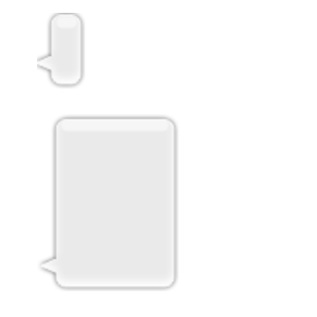

## UIImage

> An object that manages image data in your app.	
>
> 앱의 이미지 데이터를 관리하는 객체


이미지 오브젝트들은 다음과 같은 것들에 사용될 수 있다. 

- 이미지를 [`UIImageView`](https://developer.apple.com/documentation/uikit/uiimageview) 객체에 할당해 이미지를 보여준다.
- 버튼, 슬라이더, 세그먼트 컨트롤과 같은 시스템 컨트롤들을 커스텀하는데 이미지를 사용한다.
- 뷰나 다른 그래픽 컨텍스트에 이미지를 직접 그린다.
- 이미지 데이터를 필요로 하는 API에 이미지를 전달한다.


### Creating Image Objects

아래의 방법들을 사용해 이미지 객체를 생성하기 위해서는 파일이나 데이터 구조에 이미지가 있어야 한다. 

1.  [`init(named:in:compatibleWith:)`](https://developer.apple.com/documentation/uikit/uiimage/1624154-init) 메서드 (또는 `init(named:)` 메서드) 

   이미지 에셋이나 앱의 메인 번들에서 이미지를 생성한다.

   이 메서드는 이미지 데이터를 자동으로 캐싱하기 때문에 자주 사용되는 이미지에 권장된다.

   캐싱되어 있는 이미지 오브젝트가 없다면 에셋 카탈로그나 디스크에서 이미지를 생성한다. 

2.  [`imageWithContentsOfFile:`](https://developer.apple.com/documentation/uikit/uiimage/1624123-imagewithcontentsoffile) , [`init(contentsOfFile:)`](https://developer.apple.com/documentation/uikit/uiimage/1624112-init)

   초기 데이터가 번들에 있지 않은 경우에 이미지를 생성한다. 

   이 메서드는 이미지 데이터를 매번 디스크에서 로드하기 때문에 같은 이미지를 반복적으로 로드할때는 사용하지 않는 것이 좋다. 

3. [`animatedImage(with:duration:)`](https://developer.apple.com/documentation/uikit/uiimage/1624149-animatedimage) , [`animatedImageNamed(_:duration:)`](https://developer.apple.com/documentation/uikit/uiimage/1624094-animatedimagenamed) 

   여러개의 연속적인 이미지들을 압축한 하나의 `UIImage` 객체를 생성한다.

   결과 이미지를  [`UIImageView`](https://developer.apple.com/documentation/uikit/uiimageview) 객체에 넣어 애니메이션을 만든다.


### Defining a Stretchable Image

[`resizableImage(withCapInsets:)`](https://developer.apple.com/documentation/uikit/uiimage/1624102-resizableimage) 또는 [`resizableImage(withCapInsets:resizingMode:)`](https://developer.apple.com/documentation/uikit/uiimage/1624127-resizableimage)메서드를 사용해서 stretchable 이미지를 정의할 수 있다. 이 인셋들은이미지를 두 개 이상의 부분으로 세분화한다. 각 인셋 영역에 0이 아닌 값을 넣어서 아래 그림과 같이 이미지를 9개로 나눌 수 있다. 




각각의 인셋은 주어진 치수로 늘어나지 않는 영역을 정의한다. 이미지의 상단 및 하단 인셋은 고정된 높이를 유지하고 왼쪽과 오른쪽의 인셋은 고정된 넓이를 유지한다. 아래 그림에서는 사용 가능한 공간을 채우기 위해 이미지 자체가 늘어나면서 9개로 나눠진 이미지의 각 부분이 늘어나는 것을 보여준다. 이미지의 모서리는 가로와 세로 인셋 사이에 있기 때문에 크기가 변하지 않는다. 




```swift
let insets = UIEdgeInsets(top: 12.0, left: 20.0, bottom: 22.0, right: 12.0)
let image = UIImage(named: "messageBubble")
image?.resizableImage(withCapInsets: insets, resizingMode: .stretch)
```

&nbsp;


## UIImageView

>  이미지 뷰는 말 그대로 **이미지를 보여주는 뷰**이다. 이 이미지는 한 장의 이미지일 수도 있고 애니메이션 이미지 시퀀스일 수도 있다. 

```swift
class UIImageView: UIView
```

`UIImage` 객체를 사용해서 이미지를 그린다.


### Understanding How Images Are Scaled

이미지 뷰는  [`contentMode`](https://developer.apple.com/documentation/uikit/uiview/1622619-contentmode) 프로퍼티를 사용해서 이미지를 어떻게 보여줄지 결정한다.

이미지뷰는 공간의 전부 또는 일부에 맞게 이미지의 크기를 조절한다. 이미지뷰 자체의 크기가 변하면 필요에 따라 자동으로 이미지의 크기를 조절한다.

cap insets이 없는 경우 이미지는 이미지 뷰의 `contentMode` 프로퍼티로만 보여지는 방식이 결정된다.   [`UIView.ContentMode.scaleAspectFit`](https://developer.apple.com/documentation/uikit/uiview/contentmode/scaleaspectfit) 과 [`UIView.ContentMode.scaleAspectFill`](https://developer.apple.com/documentation/uikit/uiview/contentmode/scaleaspectfill)  모드는 이미지의 가로세로비율을 유지하면서 이미지를 공간에 맞게 fit하거나 fill 한다. 

[`UIView.ContentMode.scaleToFill`](https://developer.apple.com/documentation/uikit/uiview/contentmode/scaletofill) 모드는 이미지의 가로세로비율을 무시하고 이미지를 조절해 이미지가 왜곡될 수도 있다. 

캡 인셋이 있어서 resizble한 이미지의 경우에는 이 인셋들도 이미지에 영향을 준다. `UIImage`의 메소드인  [`resizableImage(withCapInsets:resizingMode:)`](https://developer.apple.com/documentation/uikit/uiimage/1624127-resizableimage) 를 사용해서 늘어나는 이미지를 만들수 있다.(위의 UIImage 설명 참고.) 이 타입의 이미지를 사용하면, 이미지 뷰의 `contentMode`를  [`UIView.ContentMode.scaleToFill`](https://developer.apple.com/documentation/uikit/uiview/contentmode/scaletofill) 로 설정해서 이미지가 공간 안에서 적절히 늘어나고 이미지 뷰의 바운드를 채우도록 해야한다. 


### Determining the Final Transparency of the Image

- 이미지는 이미지 뷰의 배경에 합성된다. 

- 이미지 뷰의 `isOpaque` 속성이 true 라면 이미지의 픽셀은 이미지 뷰의 배경색 위에 합성되고, 이미지 뷰의 알파 값은 무시된다.
- 이미지 뷰의 `isOpaque` 속성이 false라면 각 픽셀의 알파 값에 이미지 뷰의 알파값을 곱한 결과 값이 해당 픽셀의 실제 투명도 값이 된다. 이미지에 알파 채널이 없다면 각 픽셀의 알마 값은 1.0으로 가정한다.
- **이미지의 알파 채널과 이미지 뷰의 알파 채널을 합성하는 것은 계산 비용이 많이 드는 일이다. 일부러 이미지나 이미지 뷰의 알파 채널을 사용하지 않을 때, 성능을 향상시키기 위해서는 isOpaque 를 true로 설정해야 한다.**


### Animating a Sequence of Images

이미지 뷰는 움직이는 이미지 시퀀스를 저장하고 실행할 수 있다. 이미지 시퀀스를 `UIImage` 오브젝트 배열에 저장하고 [`animationImages`](https://developer.apple.com/documentation/uikit/uiimageview/1621068-animationimages) 프로퍼티에 할당해야한다. 한 번 할당이 되면, 애니메이션 타이밍과 시작, 멈춤을 조절하는 메서드와 프로퍼티를 사용할 수 있다. 

- 시퀀스의 모든 이미지들은 같은 사이즈여야 한다.
- 시퀀스의 모든 이미지들은 같은 content scale factor를 사용해야 한다.


### Responding to Touch Events

이미지뷰는 기본적으로 유저 이벤트를 무시한다. 만약 이미지뷰가 사용자와의 인터랙션도 처리하기를 원한다면 [`isUserInteractionEnabled`](https://developer.apple.com/documentation/uikit/uiimageview/1621063-isuserinteractionenabled) 프로퍼티를 true로 설정한다. 이후, gesture recognizer를 붙이거나, 어떤 다른 이벤트 처리 테크닉을 사용해 터치 이벤트 또는 다른 사용자가 시작한 이벤트에 응답할 수 있다.


### Tips for Improving Performance

이미지 scailing과 alpha blending은 앱의 성능에 영향을 미칠 수 있는 계산 비용이 많이 드는 것들이다. 

- 자주 사용하는 이미지가 스케일 된 버전을 캐싱한다. 
  - 작은 이미지 뷰에 큰 이미지가 자주 표시될 경우 썸네일을 미리 만들어서 썸네일 캐시에 저장하는 것이 좋다.
  - 각 이미지 뷰가 개별적으로 크기롤 조절할 필요가 줄어든다.
- 이미지 뷰의 크기에 맞는 이미지를 사용한다,.
  - 이미지 뷰의 현재 크기와 일치하도록 조절된 버전을 만든다. 
  -  [`UIImage.ResizingMode.tile`](https://developer.apple.com/documentation/uikit/uiimage/resizingmode/tile) 옵션을 사용해서 이미지 크기를 조정하는 것이 아니라 바둑판처럼 조정할 수 있는 resizable image 객체를 만들 수 있다.
- 이미지뷰를 불투명하게 만든다.
  - 투명도가 포함된 이미지(UI 요소들..)를 일부러 사용하지 않는 한 이미지뷰의 isOpaque 속성을 true로 한다.

### Debugging Issues with Your Image View

- 정확한 메소드를 사용해 이미지를 로드했는지 확인한다.
  -  [`init(named:in:compatibleWith:)`](https://developer.apple.com/documentation/uikit/uiimage/1624154-init) 메서드는 에셋 카탈로그나 앱 번들에서 이미지를 불러온다.
  - 앱 번들 외부에서 이미지를 불러오려면  [`imageWithContentsOfFile:`](https://developer.apple.com/documentation/uikit/uiimage/1624123-imagewithcontentsoffile)  를 사용한다.
- 이미지 뷰를 커스텀 드로잉을 위해 사용하지 않는다.
  - UIImageView 클래스는 콘텐츠를  [`draw(_:)`](https://developer.apple.com/documentation/uikit/uiview/1622529-draw) 메소드를 사용해 그리지 않는다. 
  - 이미지뷰는 이미지를 보여주기 위해서만 사용한다. 이미지를 포함해서 커스텀 드로잉을 하려면 `UIView`를 서브클래싱해서 이미지를 그린다. 


---

### Reference

https://developer.apple.com/documentation/uikit/uiimage

https://developer.apple.com/documentation/uikit/uiimageview

https://riptutorial.com/ios/example/8603/resizable-image-with-caps

